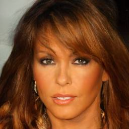
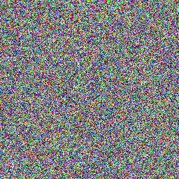
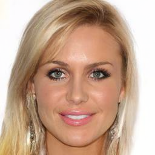
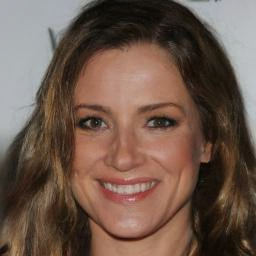

# Denoising Diffusion Probabilistic Models (DDPM)

**To understand**: [Denoising Diffusion Probabilistic Models](https://arxiv.org/abs/2006.11239)

To run the code, please run model.py and it will generate you an image.

## Creations
1. 
2. 
3. 
4. 
5. 
